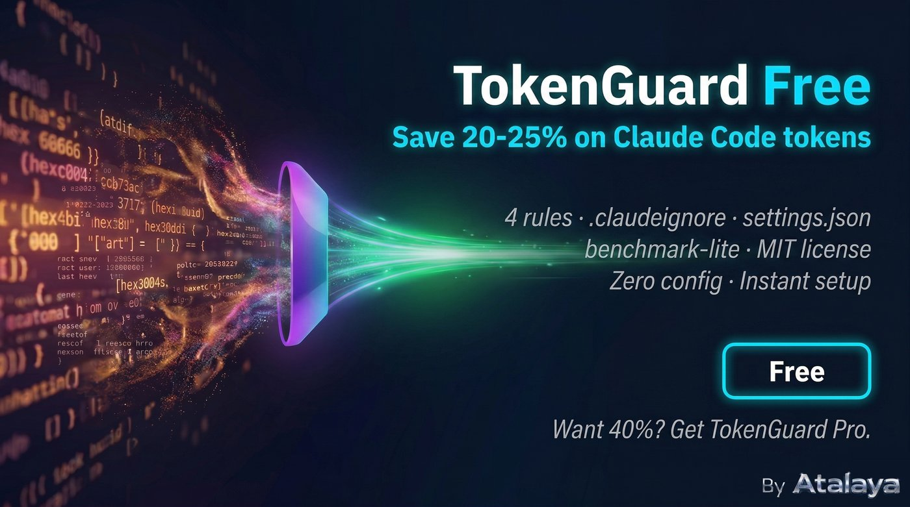

# TokenGuard — Claude Code Token Savings Kit



**Save 20-40% on Claude Code tokens by preventing waste before it happens.**

## The problem

Every Claude Code session burns tokens on patterns you don't notice: unnecessary subagent launches (40K tokens each), reimplementing existing code (70K), context overflow from re-reading files (80K). One bad session can waste 300K+ tokens.

## What TokenGuard does

4 rules that target the most expensive anti-patterns. Drop them into your project and Claude Code immediately changes how it works.

| Anti-pattern | Cost per occurrence | TokenGuard rule |
|---|---|---|
| Reimplementing without checking | 70,000 tokens | CHECK FIRST |
| Subagent instead of Grep | 40,000 tokens | GREP > AGENT |
| Untested assumption chains | 112,000 tokens | ONE AT A TIME |
| Scope creep on simple tasks | 45,000 tokens | ONLY WHAT'S ASKED |

## Quick start

```bash
# Copy into your project root
cp free/CLAUDE.md your-project/CLAUDE.md
cp free/.claudeignore your-project/.claudeignore
cp free/settings.json your-project/.claude/settings.json

# Score your setup
bash free/benchmark-lite.sh
```

Max score: **55/100** with the free tier.

## What's included

| File | Purpose |
|---|---|
| `CLAUDE.md` | 4 production-tested rules |
| `.claudeignore` | Pre-configured exclusion list (node_modules, dist, .git, etc.) |
| `settings.json` | Optimized Claude Code settings |
| `benchmark-lite.sh` | Score your setup across 3 metrics (max 55/100) |

## Want 40%? Get TokenGuard Pro

15 rules + 3 Python hooks that enforce savings automatically. Rules suggest — hooks enforce.

- **Agent Guard** — intercepts unnecessary subagent launches before they cost 40K tokens
- **Session Savings** — tracks every intervention, reports total savings at session end
- **Compact Reminder** — catches context overflow before you lose 80K tokens

Full benchmark scoring up to 100/100. Anti-patterns guide with 10 documented patterns and real token costs.

**$9 launch price** — first 50 customers. One-time payment, lifetime access.

**[Get TokenGuard Pro →](https://4229038676731.gumroad.com/l/akaye)**

## Tested in production

Built from a system running Claude Code daily with 50+ PostgreSQL tables, multiple AI agents, and automated protocols. Not theory — extracted from real usage.

Benchmark results from controlled test (same 5 tasks, with and without TokenGuard):
- Without: baseline token consumption
- With TokenGuard Pro: ~40% reduction measured

## License

MIT
