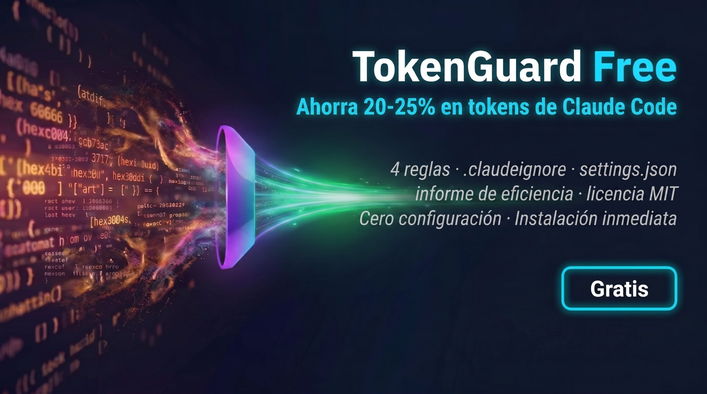

# TokenGuard — Kit de Ahorro de Tokens para Claude Code



**Reduce un 20-40% el consumo de tokens de Claude Code previniendo el desperdicio antes de que ocurra.**

## El problema

Cada sesión de Claude Code quema tokens en patrones que no notas: lanzamientos innecesarios de sub-agentes (40K tokens cada uno), reimplementar código que ya existe (70K), desbordamiento de contexto por releer archivos (80K). Una mala sesión puede desperdiciar más de 300.000 tokens.

## Qué hace TokenGuard

4 reglas que atacan los anti-patrones más caros. Cópialas en tu proyecto y Claude Code cambia inmediatamente cómo trabaja.

| Anti-patrón | Coste por ocurrencia | Regla TokenGuard |
|---|---|---|
| Implementar sin verificar | 70.000 tokens | VERIFICA ANTES |
| Sub-agente en vez de Grep | 40.000 tokens | GREP > AGENTE |
| Cadenas de suposiciones sin probar | 112.000 tokens | UNO A LA VEZ |
| Sobreingeniería en tareas simples | 45.000 tokens | SOLO LO QUE SE PIDE |

## Inicio rápido

1. Copia `tokenguard.md` en `.claude/rules/` de tu proyecto (o añade su contenido a tu `CLAUDE.md`)
2. Copia `.claudeignore` en la raíz de tu proyecto
3. Copia `settings.json` en `.claude/settings.json` de tu proyecto

```bash
# Ejemplo
cp tokenguard.md tu-proyecto/.claude/rules/tokenguard.md
cp .claudeignore tu-proyecto/.claudeignore
cp settings.json tu-proyecto/.claude/settings.json
```

## Informe de eficiencia

Ejecuta el generador de informes para ver cuántos tokens desperdicia tu agente:

```bash
python informe.py
```

Genera un dashboard HTML en `reports/` con tus métricas reales — sesiones analizadas, ratio de eficiencia, tokens desperdiciados, archivos más releídos. **Cero tokens consumidos** (solo lee logs locales).

Puedes ver un ejemplo en `reports/report-DEMO.html`.

## Contenido del paquete

| Archivo | Función |
|---|---|
| `tokenguard.md` | 4 reglas de ahorro probadas en producción |
| `informe.py` | Generador de informes de eficiencia (HTML) |
| `template-report.html` | Plantilla del dashboard |
| `.claudeignore` | Excluye archivos que Claude no necesita leer |
| `settings.json` | Límite de thinking tokens preconfigurado |
| `reports/report-DEMO.html` | Ejemplo de informe generado |

## Las cuentas

| Anti-patrón | Coste por ocurrencia |
|---|---|
| Implementar sin verificar | 70.000 tokens |
| Tormenta de sub-agentes (×3) | 120.000 tokens |
| Desbordamiento de contexto | 80.000 tokens |
| Sobreingeniería | 112.000 tokens |
| **Una mala sesión** | **300.000+ tokens** |

Con los precios de Anthropic, evitar una sola mala sesión compensa con creces.

## TokenGuard Pro

¿Quieres ir más allá? [TokenGuard Pro](https://epssistema.gumroad.com/l/tokenguard-pro) incluye:

- **15 reglas** de ahorro (11 adicionales)
- **3 hooks en Python** que bloquean errores en tiempo real
- **Benchmark completo** (100 puntos)
- **Informe Pro** con todas las secciones desbloqueadas

*Resultados basados en pruebas internas. Tu caso puede variar levemente.*

## Licencia

MIT — Úsalo donde quieras.
